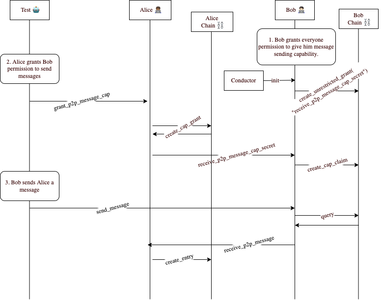

# Intermediate >> Capability Tokens ||206

```js script
import { html } from "lit";
import "@rocket/launch/inline-notification/inline-notification.js";
import {
  HolochainPlaygroundContainer,
  DhtCells,
  RunSteps,
  ZomeFnsResults,
} from "@holochain-playground/elements";
import { WorkflowType, NetworkRequestType } from "@holochain-playground/simulator";

customElements.define(
  "holochain-playground-container",
  HolochainPlaygroundContainer
);
customElements.define("dht-cells", DhtCells);
customElements.define("run-steps", RunSteps);
customElements.define("zome-fns-results", ZomeFnsResults);
```

**Capability tokens** are the unified security model of holochain. Whenever you want to call a zome function, the conductor will check whether you have capabilities to call it, and return and error if that's not the case.

This includes:

- Remote calls from other agents in the network
- Bridged calls from other DNAs
- Calls from the UI (this is not working yet)

Keep in mind that when trying to do a bridge call from a cell, if it has the same agent pub key as the callee cell, those are the same agent so the call will always be authorized to do so.

By default, all calls from other agent pub keys are **not authorized**. This means that if I try to do a remote call to another agent without having set up the capability tokens first, it will return an unauthorized error.

## Demo

First, we are going to demo how capabilities work at a high level:

1. Click `Run` to start the simulation.

- At every step, you can see what is happening with the nodes on the right panel.

2. When you are ready, click the "Play" icon on the bottom of the right panel to advance the simulation.

You can rerun it if needed.

```js story
let capGrantHash = undefined;
const steps = [
  {
    title: (context) =>
      `${context.conductors[0].name} tries to do a remote call on ${context.conductors[1].name}'s 'sample' zome function`,
    run: async (context) => {
      const aliceConductor = context.conductors[0];
      const aliceCellId = aliceConductor.getAllCells()[0].cellId;
      const bobConductor = context.conductors[1];
      const bobCellId = bobConductor.getAllCells()[0].cellId;

      context.updatePlayground({
        activeAgentPubKey: aliceCellId[1],
      });
      try {
        await aliceConductor.callZomeFn({
          cellId: aliceCellId,
          zome: "sample",
          payload: { agentToCall: bobCellId[1] },
          fnName: "remote_sample_fn",
          cap: null,
        });
      } catch (e) {}
    },
  },
  {
    title: (context) =>
      `${context.conductors[1].name} trusts her, so he creates a capability grant for ${context.conductors[0].name}`,
    run: async (context) => {
      const aliceConductor = context.conductors[0];
      const aliceCellId = aliceConductor.getAllCells()[0].cellId;
      const bobConductor = context.conductors[1];
      const bobCellId = bobConductor.getAllCells()[0].cellId;

      context.updatePlayground({
        activeAgentPubKey: bobCellId[1],
      });
      try {
        capGrantHash = await bobConductor.callZomeFn({
          cellId: bobCellId,
          zome: "sample",
          payload: { grantedAgent: aliceCellId[1] },
          fnName: "create_cap",
          cap: null,
        });
      } catch (e) {}
    },
  },
  {
    title: (context) =>
      `${context.conductors[0].name} tries to call the 'sample' function for ${context.conductors[1].name} again`,
    run: async (context) => {
      const aliceConductor = context.conductors[0];
      const aliceCellId = aliceConductor.getAllCells()[0].cellId;
      const bobConductor = context.conductors[1];
      const bobCellId = bobConductor.getAllCells()[0].cellId;

      context.updatePlayground({
        activeAgentPubKey: aliceCellId[1],
      });
      try {
        await aliceConductor.callZomeFn({
          cellId: aliceCellId,
          zome: "sample",
          payload: { agentToCall: bobCellId[1] },
          fnName: "remote_sample_fn",
          cap: null,
        });
      } catch (e) {}
    },
  },
  {
    title: (context) =>
      `${context.conductors[1].name} doesn't trust ${context.conductors[0].name} anymore, so he revokes her capability grant`,
    run: async (context) => {
      const aliceConductor = context.conductors[0];
      const aliceCellId = aliceConductor.getAllCells()[0].cellId;
      const bobConductor = context.conductors[1];
      const bobCellId = bobConductor.getAllCells()[0].cellId;

      context.updatePlayground({
        activeAgentPubKey: bobCellId[1],
      });
      try {
        await bobConductor.callZomeFn({
          cellId: bobCellId,
          zome: "sample",
          payload: { capGrantToRevoke: capGrantHash },
          fnName: "revoke_cap",
          cap: null,
        });
      } catch (e) {}
    },
  },
  {
    title: (context) =>
      `${context.conductors[0].name} tries to call the 'sample' function for ${context.conductors[1].name} again`,
    run: async (context) => {
      const aliceConductor = context.conductors[0];
      const aliceCellId = aliceConductor.getAllCells()[0].cellId;
      const bobConductor = context.conductors[1];
      const bobCellId = bobConductor.getAllCells()[0].cellId;

      context.updatePlayground({
        activeAgentPubKey: aliceCellId[1],
      });
      try {
        await aliceConductor.callZomeFn({
          cellId: aliceCellId,
          zome: "sample",
          payload: { agentToCall: bobCellId[1] },
          fnName: "remote_sample_fn",
          cap: null,
        });
      } catch (e) {}
    },
  },
];

const dna = {
  zomes: [
    {
      name: "sample",
      entry_defs: [],
      validation_functions: {},
      zome_functions: {
        create_cap: {
          call: ({ create_cap_grant }) => ({ grantedAgent }) => {
            return create_cap_grant({
              tag: "",
              access: {
                Assigned: {
                  secret: "",
                  assignees: [grantedAgent],
                },
              },
              functions: [{ zome: "sample", fn_name: "sample_fn" }],
            });
          },
          arguments: [{ type: "AgentPubKey", name: "grantedAgent" }],
        },
        sample_fn: {
          call: () => () => {
            return "Hello";
          },
          arguments: [],
        },
        revoke_cap: {
          call: ({ delete_cap_grant }) => ({ capGrantToRevoke }) => {
            return delete_cap_grant(capGrantToRevoke);
          },
          arguments: [{ type: "HeaderHash", name: "capGrantToRevoke" }],
        },
        remote_sample_fn: {
          call: ({ call_remote }) => ({ agentToCall }) => {
            return call_remote({
              agent: agentToCall,
              zome: "sample",
              fn_name: "sample_fn",
              cap: null,
              payload: null,
            });
          },
          arguments: [{ type: "AgentPubKey", name: "agentToCall" }],
        },
      },
    },
  ],
};

const simulatedHapp = {
  name: "simulated-app",
  description: "",
  slots: {
    default: {
      dna,
      deferred: false,
    },
  },
};
const sleep = (ms) => new Promise((resolve) => setTimeout(() => resolve(), ms));

export const Demo = () => html` <holochain-playground-container
  id="container"
  .numberOfSimulatedConductors=${2}
  .simulatedHapp=${simulatedHapp}
>
  <div
    style="width: 100%; display: flex; flex-direction: row; margin-bottom: 20px;"
  >
    <run-steps
      .steps=${steps}
      style="flex: 1; margin-right: 20px; height: 350px;"
    ></run-steps>
    <dht-cells
      step-by-step
      hide-filter
      style="height: 600px; flex-basis: 700px;"
      show-zome-fn-success
      .workflowsToDisplay=${[WorkflowType.CALL_ZOME]}
      .networkRequestsToDisplay=${[NetworkRequestType.CALL_REMOTE]}
    ></dht-cells>
  </div>
</holochain-playground-container>`;
```

## Sequence diagram

Here is a sequence diagram of how two clients might interact using CapGrants and CapClaims.
First Alice creates a CapGrant and sends it to Bob. Then when Bob wants to send Alice a
message, Bob first retrieves the CapClaim from Bob's chain and uses it to send a message to
Alice.

Note that the Test acts like an artificial driver of the two Agents' behavior.



## Subconsious Checks

When a zome function call is received, holochain's subconscious does these checks:

- Is the called signed by the agent that sent it? (The signing is done automatically by the sender)
  - If not, return unauthorized error
- Is the public key of the agent the same one than the one of the cell we are trying to call?
  - If so, skip all other checks
- Do I have an unrevoked capability grant for this zome function, that contains the secret and the agent that is trying to do the call as an assignee?
  - If not, return unauthorized error

## HDK actions

- `generate_cap_secret`: creates a new random capability secret
- `create_cap_grant`: creates a capability grant with the given access configuration
- `create_cap_claim`: creates a capability to store the secret that allows the agent to call that zome function
- `update_cap_grant`: updates the given capability grant
- `delete_cap_grant`: revokes the given capability grant, so new calls with that secret or agent will fail

## Data structures

```rust
/// The entry for the ZomeCall capability grant.
/// This data is committed to the callee's source chain as a private entry.
/// The remote calling agent must provide a secret and we source their pubkey from the active
/// network connection. This must match the strictness of the CapAccess.
pub struct CapabilityGrant {
    /// A string by which to later query for saved grants.
    /// This does not need to be unique within a source chain.
    pub tag: String,
    /// Specifies who may claim this capability, and by what means
    pub access: CapAccess,
    /// Set of functions to which this capability grants ZomeCall access
    pub functions: GrantedFunctions,
    // @todo the payloads to curry to the functions
    // pub curry_payloads: CurryPayloads,
}

/// Represents access requirements for capability grants.
enum CapAccess {
    /// No restriction: callable by anyone.
    Unrestricted,
    /// Callable by anyone who can provide the secret.
    Transferable {
        /// The secret.
        secret: CapSecret,
    },
    /// Callable by anyone in the list of assignees who possesses the secret.
    Assigned {
        /// The secret.
        secret: CapSecret,
        /// Agents who can use this grant.
        assignees: HashSet<AgentPubKey>,
    },
}

/// System entry to hold a capability token claim for use as a caller.
/// Stored by a claimant so they can remember what's necessary to exercise
/// this capability by sending the secret to the grantor.
 struct CapabilityClaim {
    /// A string by which to later query for saved claims.
    /// This does not need to be unique within a source chain.
    tag: String,
    /// AgentPubKey of agent who authored the corresponding CapGrant.
    grantor: AgentPubKey,
    /// The secret needed to exercise this capability.
    /// This is the only bit sent over the wire to attempt a remote call.
    /// Note that the grantor may have revoked the corresponding grant since we received the claim
    /// so claims are only ever a 'best effort' basis.
    secret: CapSecret,
}

```

## Exercise

### Problem statement

We need to code a small zome that has the following abilities:

- Give Unrestricted capability access to other agents so agents may receive cap secrets for transferable or assigned tokens
- Ability to grant transferable cability access to some agent
- Ability to grant assigned cability access to some agent
- Ability to get cap claims received from other agents

<inline-notification type="tip" title="Exercise">

1. Go to the [source code for the exercise](https://github.com/holochain-gym/developer-exercises/tree/main/2.intermediate/5.capability-tokens).
2. Implement all `unimplemented!()` functions in the exercise.
3. Run `npm test` to test your implementation.

</inline-notification>

### Relevant HDK documentation:

- [call_remote](https://docs.rs/hdk/0.0.129/hdk/p2p/fn.call_remote.html).
- [create_cap_grant](https://docs.rs/hdk/0.0.129/hdk/capability/fn.create_cap_grant.html)

## Solution

If you get stuck implementing this exercise, you can always look at its [solution](https://github.com/holochain-gym/developer-exercises/tree/solution/ntermediate/3.capability-tokens).
