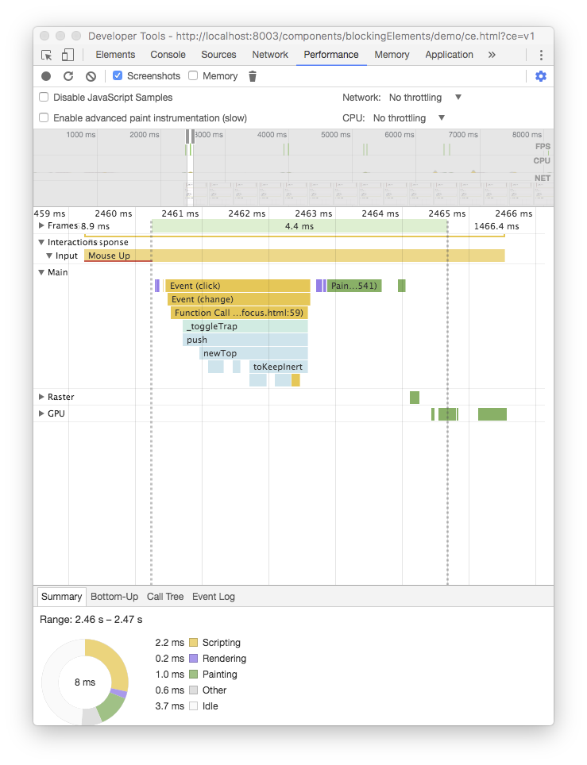
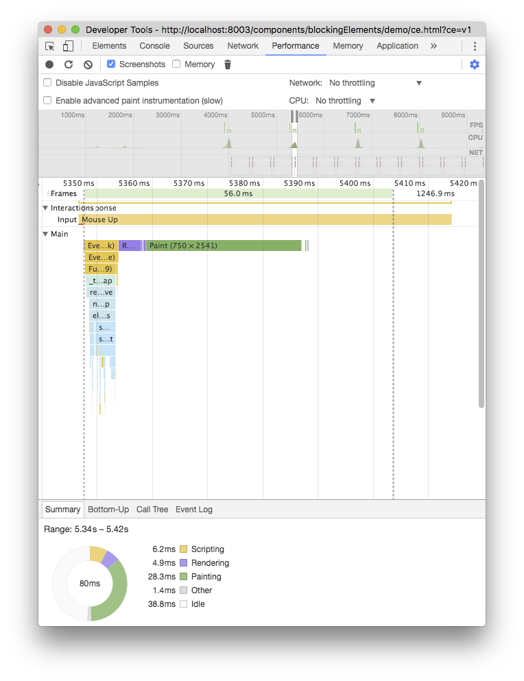
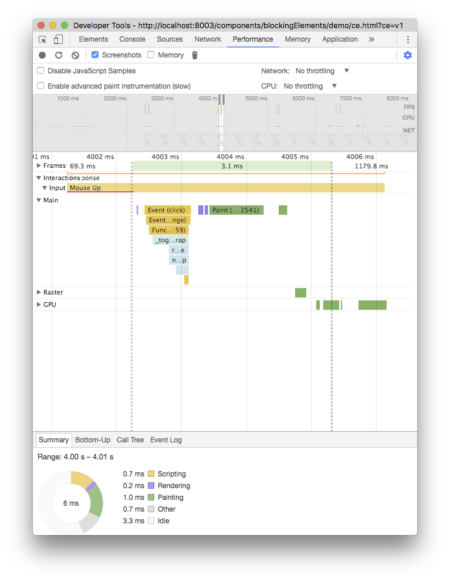
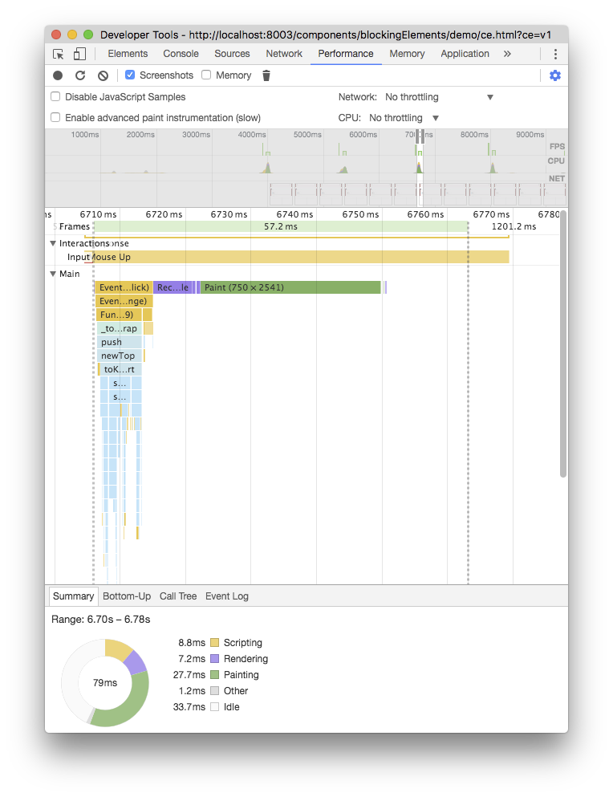
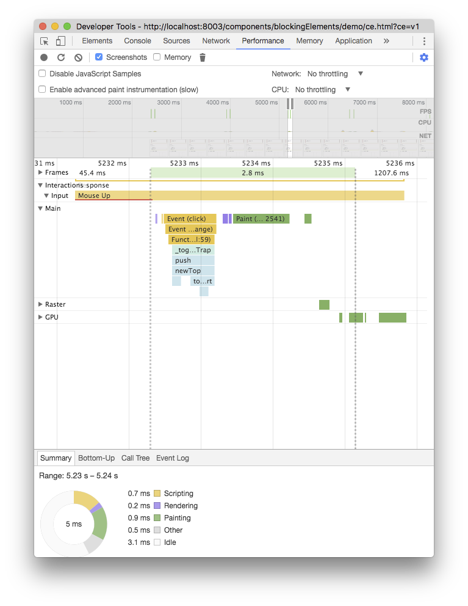
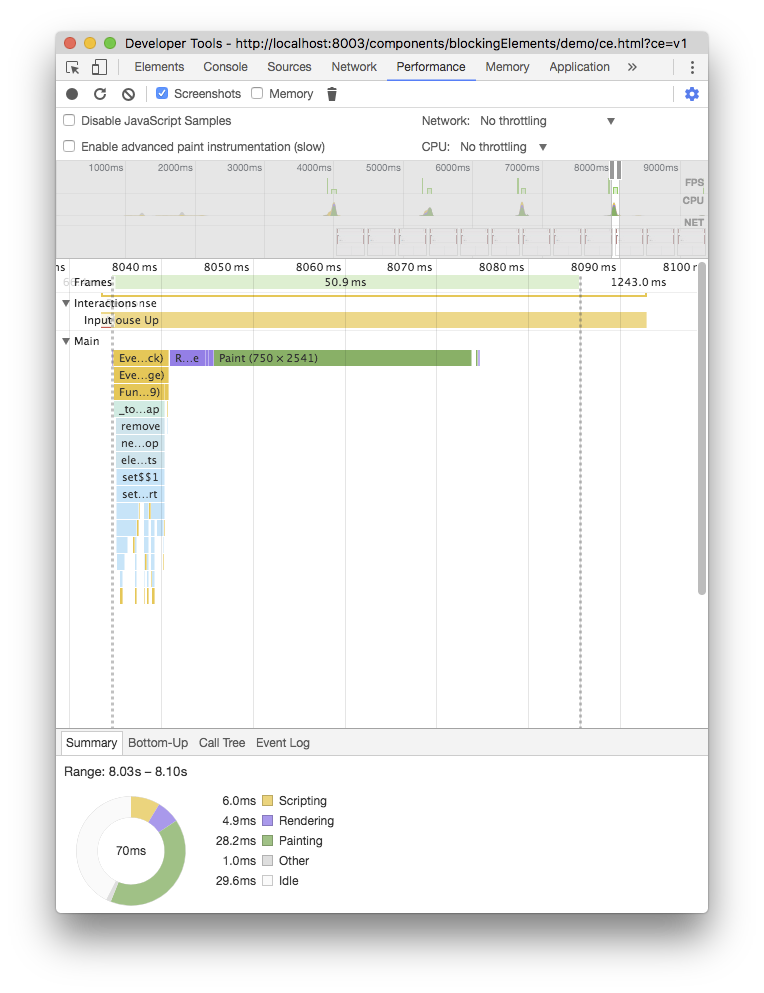
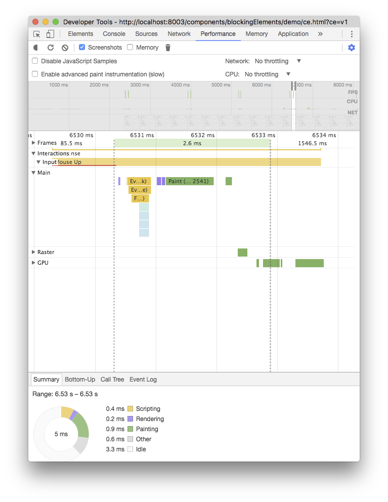

[](https://travis-ci.org/PolymerLabs/blocking-elements)
[](https://www.npmjs.com/package/blocking-elements)

# Blocking Elements stack API

Implementation of proposal https://github.com/whatwg/html/issues/897

> The polyfill chooses a non-colliding name (`document.$blockingElements` instead of `document.blockingElements`) as the proposal is still work in progress and hasn't yet reached consensus on the semantics and functionality (see [this discussion](https://github.com/PolymerLabs/blocking-elements/pull/1#issuecomment-235102344) for more details).

`document.$blockingElements` manages a stack of elements that inert the interaction outside them.

- the stack can be updated with the methods `push(elem), remove(elem), pop()`
- the top element (`document.$blockingElements.top`) and its subtree is the interactive part of the document
- `has(elem)` returns if the element is a blocking element

This polyfill will:

- search for the path of the element to block up to `document.body`
- set `inert` to all the siblings of each parent, skipping the parents and the element's distributed content (if any)

Use this polyfill together with the [wicg-inert](https://github.com/WICG/inert) polyfill to disable interactions on the rest of the document. See the [demo page](https://github.com/PolymerLabs/blocking-elements/blob/master/demo/index.html) as an example.

## Why not listening to events that trigger focus change?

Another approach could be to listen for events that trigger focus change (e.g. `focus, blur, keydown`) and prevent those if focus moves out of the blocking element.

Wrapping the focus requires to find all the focusable nodes within the top blocking element, eventually sort by tabindex, in order to find first and last focusable node.

This approach doesn't allow the focus to move outside the window (e.g. to the browser's url bar, dev console if opened, etc.), and is less robust when used with assistive technology (e.g. android talkback allows to move focus with swipe on screen, Apple Voiceover allows to move focus with special keyboard combinations).

## Install & use

Blocking Elements relies on the [`inert` attribute](https://github.com/WICG/inert) and uses [`Set` objects](https://developer.mozilla.org/en-US/docs/Web/JavaScript/Reference/Global_Objects/Set), so make sure to include their polyfills as needed.

```bash
npm install --save babel-polyfill
npm install --save wicg-inert
npm install --save blocking-elements
```

```html
<script src="./node_modules/babel-polyfill/dist/polyfill.min.js"></script>
<script src="./node_modules/wicg-inert/dist/inert.min.js"></script>
<script src="./node_modules/blocking-elements/dist/blocking-elements.min.js"></script>

<div id="container">
  <button onclick="makeBlocking(container)">make blocking</button>
  <button onclick="undoBlocking(container)">undo blocking</button>
</div>

<button>some button</button>

<script>
  function makeBlocking(element) {
    document.$blockingElements.push(element);
  }
  function undoBlocking(element) {
    document.$blockingElements.remove(element);
  }
</script>
```

## Files

Two scripts are included:

1. `/dist/blocking-elements.min.js`: minified and transpiled to ES5.

2. `/dist/blocking-elements.js`: un-minified ES2017.

   If your toolchain supports Node-style module resolution (e.g. TypeScript's `--moduleResolution=node`), then the main `blocking-elements` bare module specifier resolves to this file. TypeScript declarations are also included for this module:
   
   ```ts
   import {DocumentWithBlockingElements} from 'blocking-elements';

   const blockingElements =
       (document as DocumentWithBlockingElements).$blockingElements;

   blockingElements.push(...);
   blockingElements.remove(...);
   ```


## Local development

Install the dependencies with `npm install` and serve the resources.

Run the tests locally by navigating to http://localhost:8080/test/

## Performance

Performance is dependent on the `inert` polyfill performance. Chrome recently landed [the `inert` attribute implementation](https://codereview.chromium.org/2088453002/) behind a flag.

Let's compare the how long it takes to toggle the deepest `x-trap-focus` inside nested `x-b` of the demo page (<http://localhost:8080/demo/ce.html?ce=v1>)

.

`document.$blockingElements` with native inert is **~15x faster** than polyfilled inert 🎉 🎉 🎉

| with polyfilled inert (M58) | with native inert (M60) |
|----------|--------|
|  |  |
|  |  |
|  |  |
|  |  |
